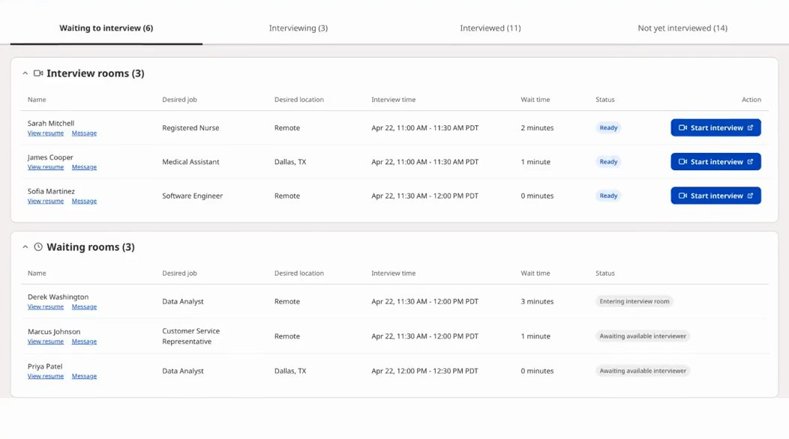

# Event details page — developer notes

Four changes to the event details page template, approved 1 Sep 2026. The deployed copy of this document, with the same content, is https://scottjobagent.github.io/jobfairx-marketing-preview/event-details-dev-notes.html

## Read this first

Four changes to the event details page template . They apply to every event type and every city page, because they change the template, not one event.

Header, footer and everything not named below stay exactly as they are on the live site. Apply only the content changes here.

Visual reference for all four: https://scottjobagent.github.io/jobfairx-marketing-preview/event-details-by-brand.html . Toggle the brand bar at the top to see the page in each event type; the bar itself is a review tool and is not part of the update.

Live example for orientation: Houston Healthcare .

- Change 1 — replace the video section with the Hiring Event Demo band.
- Change 2 — add the Choose Your Interview Format section directly below it.
- Change 3 — replace How It Works with the Review Interview Outcomes section.
- Change 4 — remove the Built-in Tools section.

The compiled Tailwind on the live site has no runtime, so anything new here ships as scoped CSS under .jfx-wk-* , .jfx-fmt-* and .jfx-ro-* . No new Tailwind classes are relied on.

## Change 1 · Replace the video section with the Hiring Event Demo

Where: the section #how-it-works-video — eyebrow “Watch walkthrough”, heading “See How JobFairX Works”, the YouTube embed. Remove that whole <section> and put this one in its place. It sits after the stats and logo strip, before How It Works.

What it is: a navy band. Left: eyebrow, headline, five numbered steps. Right: a poster frame with our own play button. The YouTube iframe is created only when the poster is clicked, so none of YouTube’s chrome appears on the page until the visitor asks for the video.

> **Copy**
>
> HIRING EVENT DEMO
> 
> Manage your hiring event from start to finish.
> 
> 1. Choose your interview format
> 2. Add interviewers
> 3. Manage interview requests
> 4. Manage the event-day lobby
> 5. Conduct interviews

Poster image: walkthrough-poster.jpg (1052×586, 52 KB). Copy it into your assets and point the  at it. It is a frame from the video, so it stays accurate if the video does. No lazy-loading needed; it is one small image near the top of the page.

Video: YouTube cDvxtuvm7mA (“How to Run Your Hiring Event”). Same video for every event type.

```html
<section class="jfx-wk">
<div class="jfx-wk-in">
<div class="jfx-wk-text">
<p class="jfx-wk-eyeb">Hiring Event Demo</p>
<h2 class="jfx-wk-h">Manage your hiring event from start to finish.</h2>
<ul class="jfx-wk-steps">
<li class="jfx-wk-s">
<span class="jfx-wk-n">1</span>
<span class="jfx-wk-st">Choose your interview format</span>
</li>
<li class="jfx-wk-s">
<span class="jfx-wk-n">2</span>
<span class="jfx-wk-st">Add interviewers</span>
</li>
<li class="jfx-wk-s">
<span class="jfx-wk-n">3</span>
<span class="jfx-wk-st">Manage interview requests</span>
</li>
<li class="jfx-wk-s">
<span class="jfx-wk-n">4</span>
<span class="jfx-wk-st">Manage the event-day lobby</span>
</li>
<li class="jfx-wk-s">
<span class="jfx-wk-n">5</span>
<span class="jfx-wk-st">Conduct interviews</span>
</li>
</ul>
</div>
<div class="jfx-wk-media">
<button type="button" class="jfx-wk-poster" data-yt="cDvxtuvm7mA" aria-label="Play the hiring event demo">

<span class="jfx-wk-scrim">
</span>
<span class="jfx-wk-btn">
<svg width="26" height="26" viewBox="0 0 24 24" fill="currentColor" aria-hidden="true">
<path d="M8 5v14l11-7z"/>
</svg>
</span>
</button>
</div>
</div>
</section>
```

```css
.jfx-wk{position:relative;overflow:hidden;background:#00245b;padding:56px 0;
   background-image:radial-gradient(900px 460px at 86% -8%,#00306f 0%,rgba(0,48,111,0) 62%)}
 @media (min-width:1024px){.jfx-wk{padding:88px 0}}
 .jfx-wk-in{position:relative;z-index:1;max-width:1180px;margin:0 auto;padding:0 16px;
   display:grid;grid-template-columns:1fr;gap:34px;align-items:center}
 @media (min-width:640px){.jfx-wk-in{padding:0 24px}}
 @media (min-width:1024px){.jfx-wk-in{padding:0 32px;gap:64px;
   grid-template-columns:minmax(0,460px) minmax(0,1fr)}}
 .jfx-wk-eyeb{margin:0 0 16px;font-size:12.5px;font-weight:700;letter-spacing:.14em;
   text-transform:uppercase;color:#8fbbff;display:flex;align-items:center;gap:10px;flex-wrap:wrap}
 .jfx-wk-h{margin:0 0 30px;font-size:28px;font-weight:600;letter-spacing:-.025em;
   line-height:1.12;color:#fff}
 @media (min-width:1024px){.jfx-wk-h{font-size:36px}}
   justify-content:center;font-size:13.5px;font-weight:600;color:#9fc6ff;
   background:rgba(255,255,255,.06);border:1px solid rgba(159,198,255,.4);
   font-variant-numeric:tabular-nums}
 @media (min-width:1024px){.jfx-wk-st{font-size:18px}}
 .jfx-wk-poster{display:block;width:100%;padding:0;border:1px solid rgba(159,198,255,.2);
   border-radius:14px;overflow:hidden;position:relative;cursor:pointer;background:#001b46;
   box-shadow:0 20px 60px rgba(0,0,0,.34);transition:transform .2s ease,box-shadow .2s ease}
 .jfx-wk-poster:hover{transform:translateY(-2px);box-shadow:0 26px 70px rgba(0,0,0,.42)}
 .jfx-wk-poster:focus-visible{outline:3px solid #8fbbff;outline-offset:3px}
 .jfx-wk-poster img{display:block;width:100%;height:auto}
 .jfx-wk-scrim{position:absolute;inset:0;background:rgba(0,20,54,.24)}
 .jfx-wk-btn{position:absolute;left:50%;top:50%;transform:translate(-50%,-50%);width:74px;
   height:74px;border-radius:50%;background:#fff;color:#00245b;display:flex;align-items:center;
   justify-content:center;box-shadow:0 8px 30px rgba(0,0,0,.34);transition:transform .2s ease}
 .jfx-wk-btn svg{margin-left:4px}
 .jfx-wk-poster:hover .jfx-wk-btn{transform:translate(-50%,-50%) scale(1.06)}
 .jfx-wk-frame{width:100%;aspect-ratio:16/9;border:0;border-radius:14px;display:block}
```

```js
document.querySelector('.jfx-wk-poster').addEventListener('click', function () {
  var f = document.createElement('iframe');
  f.className = 'jfx-wk-frame';
  f.src = 'https://www.youtube.com/embed/cDvxtuvm7mA?rel=0&autoplay=1';
  f.title = 'How to Run Your Hiring Event';
  f.allow = 'accelerometer; autoplay; encrypted-media; picture-in-picture';
  f.allowFullscreen = true;
  this.replaceWith(f);
});
```

> Note: Navy is #00245b , the same dark used on the employer home page’s reschedule section. Not a new colour.

## Change 2 · Add the Choose Your Interview Format section

Where: a new section directly below the Hiring Event Demo and above How It Works. White background.

What it is: centred eyebrow, headline and one-paragraph sub, then three equal cards — Video, In person, Phone, in that order. Each card has a soft gradient header, an icon tile, a title and a description. No links on the cards.

The city token: the sub names the event’s city. Render {City} from the event record, city only, no state — “Houston”, “Los Angeles”, “Chicago”.

> **Copy**
>
> CHOOSE YOUR INTERVIEW FORMAT
> 
> Meet candidates by video, in person, or phone.
> 
> Select how you want to conduct interviews for the {City} hiring event. Choose the format that works best for your hiring process.
> 
> Video
> Conduct interviews directly on the JobFairX platform. Candidates receive a secure link to join their interview.
> 
> In person
> Provide the interview address and attendance instructions. Candidates receive the details they need to arrive prepared.
> 
> Phone
> Call candidates at their scheduled interview time. Their phone number and interview details are available in JobFairX.

```html
<section class="jfx-fmt">
<span class="jfx-fmt-arc" aria-hidden="true">
</span>
<span class="jfx-fmt-dots" aria-hidden="true">
</span>
<div class="jfx-fmt-in">
<p class="jfx-fmt-eyeb">Choose Your Interview Format</p>
<h2 class="jfx-fmt-h">Meet candidates by video, in person, or phone.</h2>
<p class="jfx-fmt-sub">Select how you want to conduct interviews for the {City} hiring event. Choose the format that works best for your hiring process.</p>
<div class="jfx-fmt-cards">
<div class="jfx-fmt-c jfx-fmt-blue">
<div class="jfx-fmt-cap">
<span>
</span>
</div>
<div class="jfx-fmt-body">
<div class="jfx-fmt-tile">
<svg width="26" height="26" viewBox="0 0 24 24" fill="none" stroke="currentColor" stroke-width="2" stroke-linecap="round" stroke-linejoin="round" aria-hidden="true">
<path d="m22 8-6 4 6 4V8Z"/>
<rect width="14" height="12" x="2" y="6" rx="2"/>
</svg>
</div>
<h3 class="jfx-fmt-t">Video</h3>
<p class="jfx-fmt-d">Conduct interviews directly on the JobFairX platform. Candidates receive a secure link to join their interview.</p>
</div>
</div>
<div class="jfx-fmt-c jfx-fmt-green">
<div class="jfx-fmt-cap">
<span>
</span>
</div>
<div class="jfx-fmt-body">
<div class="jfx-fmt-tile">
<svg width="26" height="26" viewBox="0 0 24 24" fill="none" stroke="currentColor" stroke-width="2" stroke-linecap="round" stroke-linejoin="round" aria-hidden="true">
<circle cx="12" cy="12" r="4"/>
<path d="M12 3v3M12 18v3M3 12h3M18 12h3"/>
<circle cx="12" cy="12" r="1.2" fill="currentColor" stroke="none"/>
</svg>
</div>
<h3 class="jfx-fmt-t">In person</h3>
<p class="jfx-fmt-d">Provide the interview address and attendance instructions. Candidates receive the details they need to arrive prepared.</p>
</div>
</div>
<div class="jfx-fmt-c jfx-fmt-amber">
<div class="jfx-fmt-cap">
<span>
</span>
</div>
<div class="jfx-fmt-body">
<div class="jfx-fmt-tile">
<svg width="26" height="26" viewBox="0 0 24 24" fill="none" stroke="currentColor" stroke-width="2" stroke-linecap="round" stroke-linejoin="round" aria-hidden="true">
<path d="M22 16.9v3a2 2 0 0 1-2.2 2 19.8 19.8 0 0 1-8.6-3.1 19.5 19.5 0 0 1-6-6A19.8 19.8 0 0 1 2.1 4.2 2 2 0 0 1 4.1 2h3a2 2 0 0 1 2 1.7c.1 1 .4 1.9.7 2.8a2 2 0 0 1-.5 2.1L8.1 9.9a16 16 0 0 0 6 6l1.3-1.3a2 2 0 0 1 2.1-.4c.9.3 1.8.6 2.8.7a2 2 0 0 1 1.7 2z"/>
</svg>
</div>
<h3 class="jfx-fmt-t">Phone</h3>
<p class="jfx-fmt-d">Call candidates at their scheduled interview time. Their phone number and interview details are available in JobFairX.</p>
</div>
</div>
</div>
</div>
</section>
```

```css
.jfx-fmt{position:relative;overflow:hidden;background:#fff;padding:56px 0}
 @media (min-width:1024px){.jfx-fmt{padding:90px 0}}
 .jfx-fmt-arc{position:absolute;top:-190px;right:-140px;width:520px;height:520px;
   border-radius:50%;background:#F4F7FF;pointer-events:none}
 .jfx-fmt-dots{position:absolute;left:22px;bottom:34px;width:170px;height:78px;opacity:.55;
   pointer-events:none;background-image:radial-gradient(#C7D2FE 1.6px,transparent 1.6px);
   background-size:14px 14px}
 .jfx-fmt-in{position:relative;z-index:1;max-width:1180px;margin:0 auto;padding:0 16px}
 @media (min-width:640px){.jfx-fmt-in{padding:0 24px}}
 @media (min-width:1024px){.jfx-fmt-in{padding:0 32px}}
 .jfx-fmt-eyeb{margin:0 0 14px;text-align:center;font-size:13px;font-weight:700;
   letter-spacing:.12em;text-transform:uppercase;color:#2563eb}
 .jfx-fmt-h{margin:0 0 14px;text-align:center;font-size:28px;font-weight:600;
   letter-spacing:-.02em;line-height:1.12;color:#0b1220}
 @media (min-width:1024px){.jfx-fmt-h{font-size:40px}}
 .jfx-fmt-sub{margin:0 auto 40px;max-width:660px;text-align:center;font-size:16px;
   line-height:1.6;color:#5a6478}
 @media (min-width:1024px){.jfx-fmt-sub{font-size:18px;margin-bottom:52px}}
 .jfx-fmt-cards{display:grid;grid-template-columns:1fr;gap:18px}
 @media (min-width:768px){.jfx-fmt-cards{grid-template-columns:repeat(3,minmax(0,1fr));gap:24px}}
 .jfx-fmt-c{display:flex;flex-direction:column;background:#fff;border:1px solid #e9e7e3;
   border-radius:16px;overflow:hidden;transition:box-shadow .2s ease,transform .2s ease}
 .jfx-fmt-c:hover{box-shadow:0 10px 34px rgba(0,0,0,.06);transform:translateY(-2px)}
 .jfx-fmt-cap{position:relative;height:132px;overflow:hidden}
 .jfx-fmt-cap span{position:absolute;right:-52px;top:-46px;width:172px;height:172px;
   border-radius:50%;background:rgba(255,255,255,.34)}
 .jfx-fmt-blue .jfx-fmt-cap{background:linear-gradient(135deg,#edf1ff,#d9e2ff)}
 .jfx-fmt-green .jfx-fmt-cap{background:linear-gradient(135deg,#e8f7f1,#cbeade)}
 .jfx-fmt-amber .jfx-fmt-cap{background:linear-gradient(135deg,#fef5e6,#fae6c2)}
 .jfx-fmt-body{display:flex;flex-direction:column;flex:1;padding:0 24px 26px}
 .jfx-fmt-tile{position:relative;z-index:1;width:56px;height:56px;border-radius:15px;
   display:flex;align-items:center;justify-content:center;margin:-28px 0 16px;
   box-shadow:0 1px 2px rgba(0,0,0,.04)}
 .jfx-fmt-blue .jfx-fmt-tile{background:#edf1ff;color:#2563eb}
 .jfx-fmt-green .jfx-fmt-tile{background:#e8f7f1;color:#0e9488}
 .jfx-fmt-amber .jfx-fmt-tile{background:#fef5e6;color:#b45309}
 .jfx-fmt-t{margin:0 0 10px;font-size:22px;font-weight:500;letter-spacing:-.01em;color:#0b1220}
 .jfx-fmt-d{margin:0;font-size:15.5px;line-height:1.55;color:#5a6478}
```

> Note: The three card colours are the calendar’s existing event-type palette ( #2563eb , #0e9488 , #b45309 ). The decorative arc and dot pattern are pure CSS on the section; nothing to export.

## Change 3 · Replace How It Works with Review Interview Outcomes

Where: the How It Works section — eyebrow “How It Works”, heading “Hiring Events Built Around Interviews”, three alternating rows with product panels. Remove that whole <section class="how-section…"> and put this one in its place, between the format cards and the testimonials.

Why: two of its three rows repeat what the Hiring Event Demo now says. The third row — the post-event report — is the one thing nothing else on the page covers, so it becomes its own section.

What it is: light-grey band. Left: eyebrow, headline, one line, three checked points, a link. Right: the post-event report panel you already have — it is the third row’s visual from the current How It Works, moved here unchanged. Its date line must be the event’s own date; today the live panel shows a different old date on every event type (Apr 22 on Healthcare, Nov 13 2025 on Technology, and so on), which is a bug worth fixing while you are in there.

> **Copy**
>
> AFTER THE EVENT
> 
> Review interview outcomes.
> 
> Your post-event report is ready in your dashboard. Every interview, every outcome, and who on your team saw whom.
> 
> ✓ Yes, maybe, or no for each candidate, with your team’s notes
> ✓ Who interviewed whom, and who didn’t show
> ✓ Message candidates or schedule next&#8209;round interviews straight from the report
> 
> Register for an event →

```html
<section class="jfx-ro">
<div class="jfx-ro-in">
<div class="jfx-ro-text">
<p class="jfx-ro-eyeb">After the Event</p>
<h2 class="jfx-ro-h">Review interview outcomes.</h2>
<p class="jfx-ro-sub">Your post&#8209;event report is ready in your dashboard. Every interview, every outcome, and who on your team saw whom.</p>
<ul class="jfx-ro-list">
<li>
<span class="jfx-ro-ck" aria-hidden="true">
<svg width="10" height="10" viewBox="0 0 24 24" fill="none" stroke="currentColor" stroke-width="3.5" stroke-linecap="round" stroke-linejoin="round">
<path d="M20 6 9 17l-5-5"/>
</svg>
</span>
<span>
<b>Yes, maybe, or no</b> for each candidate, with your team&#8217;s notes</span>
</li>
<li>
<span class="jfx-ro-ck" aria-hidden="true">
<svg width="10" height="10" viewBox="0 0 24 24" fill="none" stroke="currentColor" stroke-width="3.5" stroke-linecap="round" stroke-linejoin="round">
<path d="M20 6 9 17l-5-5"/>
</svg>
</span>
<span>
<b>Who interviewed whom,</b> and who didn&#8217;t show</span>
</li>
<li>
<span class="jfx-ro-ck" aria-hidden="true">
<svg width="10" height="10" viewBox="0 0 24 24" fill="none" stroke="currentColor" stroke-width="3.5" stroke-linecap="round" stroke-linejoin="round">
<path d="M20 6 9 17l-5-5"/>
</svg>
</span>
<span>
<b>Message candidates or schedule next&#8209;round interviews</b> straight from the report</span>
</li>
</ul>
<a href="#" class="jfx-ro-link">Register for an event <span>&rarr;</span>
</a>
</div>
<div class="jfx-ro-media">
<!-- your existing post-event report panel, dated to the event -->
</div>
</div>
</section>
```

```css
.jfx-ro{background:#f8fafc;padding:56px 0;border-top:1px solid #eef2f7}
 @media (min-width:1024px){.jfx-ro{padding:90px 0}}
 .jfx-ro-in{max-width:1180px;margin:0 auto;padding:0 16px;display:grid;grid-template-columns:1fr;
   gap:28px;align-items:center}
 @media (min-width:640px){.jfx-ro-in{padding:0 24px}}
 @media (min-width:1024px){.jfx-ro-in{padding:0 32px;gap:64px;grid-template-columns:minmax(0,1fr) 560px}}
 .jfx-ro-eyeb{margin:0 0 14px;font-size:13px;font-weight:700;letter-spacing:.12em;text-transform:uppercase;color:#2563eb}
 .jfx-ro-h{margin:0 0 14px;font-size:28px;font-weight:600;letter-spacing:-.02em;line-height:1.12;color:#0b1220}
 @media (min-width:1024px){.jfx-ro-h{font-size:36px}}
 .jfx-ro-sub{margin:0 0 20px;font-size:16px;line-height:1.6;color:#5a6478;max-width:48ch}
 @media (min-width:1024px){.jfx-ro-sub{font-size:17px}}
 .jfx-ro-list{list-style:none;margin:0 0 24px;padding:0;display:flex;flex-direction:column;gap:12px}
 .jfx-ro-list li{display:grid;grid-template-columns:20px minmax(0,1fr);gap:11px;font-size:15.5px;
   line-height:1.5;color:#334155;align-items:start}
 .jfx-ro-list b{color:#0f172a;font-weight:600}
 .jfx-ro-ck{width:20px;height:20px;border-radius:50%;background:#dcfce7;color:#15803d;display:flex;
   align-items:center;justify-content:center;margin-top:2px}
 .jfx-ro-link{display:inline-block;font-size:15px;font-weight:600;color:#2563eb;text-decoration:none}
 .jfx-ro-link:hover{text-decoration:underline}
 .jfx-ro-link span{display:inline-block;margin-left:4px}
 .jfx-ro-media > div{margin-left:auto;margin-right:auto}
```

For reference, the report panel as it exists on the live page today, with the date line tokenised. Reuse your component rather than pasting this.

```html
<div class="lg:order-1">
<div class="w-full max-w-[560px] h-[420px] max-lg:h-auto max-lg:min-h-[280px] mx-auto overflow-hidden box-border bg-white border border-[#e8e6e3] rounded-[14px] p-5 shadow-[0_18px_48px_-12px_rgba(0,0,0,0.18),0_4px_12px_rgba(0,0,0,0.05)]">
<div class="flex items-baseline justify-between pb-3 border-b border-[#e8e6e3] mb-3 flex-wrap gap-1">
<div class="text-[14px] max-[640px]:text-[13px] font-bold text-[#1a1a1a]">Houston Healthcare · {Event date}</div>
</div>
<div class="flex gap-1.5 mb-3.5 flex-wrap">
<span class="text-[11px] max-[640px]:text-[10px] px-2.5 py-[5px] rounded-full bg-[#2563eb] text-white border border-[#2563eb] font-medium">All <b class="font-bold ml-1">16</b>
</span>
<span class="text-[11px] max-[640px]:text-[10px] px-2.5 py-[5px] rounded-full bg-white border border-[#e8e6e3] text-[#4b5563] font-medium">Yes <b class="font-bold ml-1 text-[#1a1a1a]">8</b>
</span>
<span class="text-[11px] max-[640px]:text-[10px] px-2.5 py-[5px] rounded-full bg-white border border-[#e8e6e3] text-[#4b5563] font-medium">Maybe <b class="font-bold ml-1 text-[#1a1a1a]">4</b>
</span>
<span class="text-[11px] max-[640px]:text-[10px] px-2.5 py-[5px] rounded-full bg-white border border-[#e8e6e3] text-[#4b5563] font-medium">No <b class="font-bold ml-1 text-[#1a1a1a]">4</b>
</span>
</div>
<div class="grid grid-cols-[1.3fr_1.1fr_0.8fr_0.8fr] gap-2.5 text-[10px] max-[640px]:text-[9px] font-bold text-[#6b6862] uppercase tracking-[0.06em] px-1 pb-2.5">
<div>Name</div>
<div>Desired job</div>
<div>Interview time</div>
<div>Feedback</div>
</div>
<div class="flex flex-col">
<div class="grid grid-cols-[1.3fr_1.1fr_0.8fr_0.8fr] gap-2.5 px-1 py-3 border-b border-[#f0eeea] items-start text-[12px] max-[640px]:text-[11px] last:border-b-0">
<div class="flex flex-col gap-[3px]">
<div class="text-[13px] max-[640px]:text-[12px] font-semibold text-[#1a1a1a]">Carla Mendoza</div>
<a href="#" class="text-[11px] max-[640px]:text-[10px] text-[#2563eb] underline underline-offset-2">View resume</a>
</div>
<div class="text-[13px] max-[640px]:text-[12px] text-[#4b5563]">Nurse<br>Practitioner</div>
<div class="text-[13px] max-[640px]:text-[12px] text-[#1a1a1a] font-medium">9:00 AM</div>
<div class="text-[12px] max-[640px]:text-[11px] px-2.5 py-1 rounded-md font-semibold inline-flex items-center justify-self-start h-fit whitespace-nowrap bg-[#dcfce7] text-[#15803d]">✓ Yes</div>
</div>
<div class="grid grid-cols-[1.3fr_1.1fr_0.8fr_0.8fr] gap-2.5 px-1 py-3 border-b border-[#f0eeea] items-start text-[12px] max-[640px]:text-[11px] last:border-b-0">
<div class="flex flex-col gap-[3px]">
<div class="text-[13px] max-[640px]:text-[12px] font-semibold text-[#1a1a1a]">Brendan Cole</div>
<a href="#" class="text-[11px] max-[640px]:text-[10px] text-[#2563eb] underline underline-offset-2">View resume</a>
</div>
<div class="text-[13px] max-[640px]:text-[12px] text-[#4b5563]">CT<br>Technologist</div>
<div class="text-[13px] max-[640px]:text-[12px] text-[#1a1a1a] font-medium">9:30 AM</div>
<div class="text-[12px] max-[640px]:text-[11px] px-2.5 py-1 rounded-md font-semibold inline-flex items-center justify-self-start h-fit whitespace-nowrap bg-[#dcfce7] text-[#15803d]">✓ Yes</div>
</div>
<div class="grid grid-cols-[1.3fr_1.1fr_0.8fr_0.8fr] gap-2.5 px-1 py-3 border-b border-[#f0eeea] items-start text-[12px] max-[640px]:text-[11px] last:border-b-0">
<div class="flex flex-col gap-[3px]">
<div class="text-[13px] max-[640px]:text-[12px] font-semibold text-[#1a1a1a]">Yuki Tanaka</div>
<a href="#" class="text-[11px] max-[640px]:text-[10px] text-[#2563eb] underline underline-offset-2">View resume</a>
</div>
<div class="text-[13px] max-[640px]:text-[12px] text-[#4b5563]">Ultrasound<br>Technologist</div>
<div class="text-[13px] max-[640px]:text-[12px] text-[#1a1a1a] font-medium">10:00 AM</div>
<div class="text-[12px] max-[640px]:text-[11px] px-2.5 py-1 rounded-md font-semibold inline-flex items-center justify-self-start h-fit whitespace-nowrap bg-[#fef9c3] text-[#a16207]">• Maybe</div>
</div>
<div class="grid grid-cols-[1.3fr_1.1fr_0.8fr_0.8fr] gap-2.5 px-1 py-3 border-b border-[#f0eeea] items-start text-[12px] max-[640px]:text-[11px] last:border-b-0">
<div class="flex flex-col gap-[3px]">
<div class="text-[13px] max-[640px]:text-[12px] font-semibold text-[#1a1a1a]">Trevor Park</div>
<a href="#" class="text-[11px] max-[640px]:text-[10px] text-[#2563eb] underline underline-offset-2">View resume</a>
</div>
<div class="text-[13px] max-[640px]:text-[12px] text-[#4b5563]">Respiratory<br>Therapist</div>
<div class="text-[13px] max-[640px]:text-[12px] text-[#1a1a1a] font-medium">11:00 AM</div>
<div class="text-[12px] max-[640px]:text-[11px] px-2.5 py-1 rounded-md font-semibold inline-flex items-center justify-self-start h-fit whitespace-nowrap bg-[#dcfce7] text-[#15803d]">✓ Yes</div>
</div>
</div>
</div>
</div>
```

## Change 4 · Remove the Built-in Tools section

Where: between How It Works and the testimonials. Eyebrow “Built-in Tools”, heading “Candidate Messaging and Interview Scheduling”, three sticky-scroll panels (Candidate Messaging, Flexible Scheduling, Interview Tracking) with the messaging and scheduling mock-ups. Opens with <section class="py-12 min-[901px]:py-24 bg-[#f8f7f4]"> .

Remove the whole section. Nothing replaces it; the testimonials move up to follow How It Works directly. It was already removed from the employer home page in the previous update.

## Checking your work

- Top of the page reads: hero → stats and logos → Hiring Event Demo → Choose Your Interview Format → Review Interview Outcomes → testimonials.
- No “See How JobFairX Works”, no “Hiring Events Built Around Interviews” and no “Built-in Tools” anywhere on the page.
- The report panel’s date line is the event’s own date.
- No runtime appears anywhere in the demo — not next to the eyebrow, not on the poster.
- Clicking the poster loads the video in place and it starts playing; before that click, the page makes no request to youtube.com.
- The format sub names the event’s city, city only.
- Cards read Video, In person, Phone, left to right, and none of them is a link.
- Nothing scrolls sideways at 375px. Cards and the poster stack full-width.
- Open any two event types side by side: the only differences in these sections are the city in the sub and nothing else.

## Files

- Visual reference, all five event types: event-details-by-brand.html
- Poster: walkthrough-poster.jpg
- This page: event-details-dev-notes.html

The review page carries all five event types in one file behind a brand bar. That is a review convenience only — production renders one event per page exactly as it does today.
